# Forecasting Percent Change in New York City Rents

**Oliver Shetler**

_Last Updated April 2022_

## Overview

The New York City rental market is one of the most expensive in the world. Moreover, many tenants do not have income commensurate with the cost of living. Additionally, when choosing a rental unit, many prospective tenants lack much of the information that would accompany other large contracts. For example, real estate agents will usually help buyers compute the expected cost of maintenance and re-sale value of a house. Car buyers and leasers can readily find data on re-sale value or contract renewal terms. By contrast, many prospective tenants cannot see what their lease renewal terms would look like in advance, much less what the reputation of their land lord is. This project aims to solve one small part of this problem by building a model that can help provide lease renewal estimates to tenants. Moreover, this project has produced a cleaned and ready-to-use version of an important city-wide real-estate data-set.

New York City collects and disseminates a tremendous amount of high quality data to the public. The PLUTO data set, produced by the department of finance, contains comprehensive building valuation data on New York rental properties. One of the most interesting aspects of the data-set is how property values change over time. Unfortunately, it is produced as fragmented individual files from incremental releases. Each year, the data set is changed in important ways. The columns included in each table differ from year to year and sometimes the definitions of variables change. Moreover, some releases divide the data set up by borough while other releases are one big file. Additionally, many variables do not conform to statistical best practices. For example, building classes are coded in a way that causes implicitly coded building features to be arbitrarily separated. As a result, interactions cannot be accounted for. As a consequence the data set does not readily support longitudinal analysis. In order to remedy this, the data-set was extensively re-engineered, as described a separate [repository](https://www.github.com/olivershetler/pluto-database). You can find the re-engineered data sets and documentation on [Kaggle](https://www.kaggle.com/olivershetler/pluto).

After re-engineering the data set, regression, random forest and boosted tree models were tested as the first step in building a high performing model for predicting the annual percent change in building valuations, which can in turn be used to estimate lease renewal terms for individual rental units. Percent changes in price are very difficult to predict, and the continuous models did not perform well. However, discretized forecasts were promising.

##  Preliminary Concepts

The Annual Percent Change (APC) of Rental Income for each building will be estimated using the Assessed Total Value Per Unit reported in the PLUTO data set, along with supplementary values such as the square footage of the building (included in PLUTO) and the local annual inflation rate (not included in PLUTO).

For income generating (rental) properties, the Assessed Total Value is equal to the Annual Market Value times a factor of 0.45, which is computed by the NYC Department of Finance as

$$
\text { Annual Market Value }=[\text { Rental Income - Expenses }] \times \frac{1}{\text { Capitalization Rate }}
$$

where the Capitalization Rate is a constant value between 0 and 1, computed for every region by the Bureau of Labor and Statistics every five years.

Since the Capitalization Rate for each region is usually constant on an annual basis and changes little when updated, it can be ignored when computing the APCs of the Annual Market Values. Let $M_t$ represent the market valuation at a given year $t$. Let $R_t$ represent the rental income at year $t$ and let $E_t$ represent the operating expenses at year $t$. Let $\Delta M_t = M_t - M_{t-1}$, let $\Delta R_t = R_t - R_{t-1}$ and let $\Delta E_t = E_t - E_{t-1}$.

Then the APC of rental income can be expressed as

$$
\frac{\Delta R_t}{R_{t-1}}
= \frac{\Delta M_t + \Delta E_t}{M_{t-1} + E_{t-1}}
$$

Unfortunately, the operational expenses are not included in the PLUTO data set. However, it is common among real estate professionals to assume that, on average, expenses are equal to one half of rental income. This cultural consensus causes many building owners to spend approximately half of their rental income on maintenance each year. Therefore, it is reasonable to assume that $\mathbb{E}(E_t) = \frac{1}{2} R_t$, which implies that  $\mathbb{E}(M_t) = R_t - \frac{1}{2} R_t = \frac{1}{2} R_t$. Therefore, we may conclude that

$$
\mathbb{E}\left(\frac{\Delta R_t}{R_{t-1}} \right) \approx \frac{\Delta M_t}{M_{t-1}}
$$

Moreover, the percent change in rent per unit (PCRPU) may be approximated as $2 M_t / N_t$, where $N_t$ is the number of units in the building on year $t$. Thus, the annual percent change in rental income per unit may be approximated as the percent change in value per unit (PCVPU).
$$
\mathbb{E}(\text{PCRPU}) \approx \frac{2 M_t / N_t - 2 M_{t-1} / N_{t-1}}{2 M_{t-1} / N_{t-1}} = \frac{ M_t / N_t -  M_{t-1} / N_{t-1}}{ M_{t-1} / N_{t-1}} = \text{PCVPU}
$$

Since PCRPU is the average change in rent per unit—without data on individual units—it is the expected value of individual unit percent changes in rent (UPCR). That is,
$$
\text{PCVPU} = \mathbb{E}(\text{PCRPU})
 = \mathbb{E}\left(\frac{1}{N} \sum_{i=1}^{N} \text{UPCR}\right) = \mathbb{E}\big(\mathbb{E}(\text{UPCR})\big) = \mathbb{E}(\text{UPCR})
$$

Thus, the best estimator of UPCR is PCVPU. As a result, it is our target for forecasting.

Unfortunately, there is an additional wrinkle. Percent changes are not good targets for forecasting because negative percent changes are bounded at -100%, causing their distributions to violate implicit assumptions in most models. One solution to this problem is to symmetrize the data using the transformation

`(CASE WHEN pcvpu_L1 < 0 THEN -100*(1/(pcvpu_L1 + 1)-1) ELSE 100*pcvpu_L1 END)`

Moreover, percent changes are normalized across properties, so learning the intrinsic value of a given building cannot be used to (speciously) boost the performance models. As a result, the continuous predicton remains challenging. Terefore, if precision is not a major issue, the best solution is to use a discretized version of the percent change in value per unit (PCVPU) as the target variable.

For the purposes of modeling lease renewal terms, the percent changes in value per unit (PCVPU) are discretized into a set of bins. The bins are defined as follows:
- less than or equal to 0%
- greater than 0% and less than or equal to 5%
- greater than 5% less than or equal to 10%
- above 10%

The first bucket (less than 0%) was chosen to capture the intution that a building with a negative or no percent change in value per unit (PCVPU) is likely offer an unchanged lease renewal price, as buildings almost never lower rents of their own volition (even in hard times, inflation usually prevents building owners from lowering rents). The second bucket is designed to capture the notion of a "small" increase in rents. The third bucket is designed to capture the notion of a "moderate" increase in rents and the fourth bucket is designed to capture the notion of a "large" increase in rents.

The number of records that fell into each category were distributed as follows:

``` {.text}
 below-0% | 0%-5%  | 5%-10% | above-10%
----------+--------+--------+-----------
   340141 | 706984 | 688105 |    226051
```

## Data

The feature variables are discussed in detail in the [PLUTO Database Repository](https://github.com/olivershetler/pluto-database) and on the [Kaggle page](https://www.kaggle.com/datasets/olivershetler/pluto) where the data set from this project is located.

There is one very important feature of the data set that should be noted. The reporting standards for the assessed total value of lots (from which PCVPU is derived) changed in 2018. The old standards were to report the taxable assessed value of the lot, which is approximately 66% of the assessed market value. The true computation is more complex, and cannot be reverse engineered from the data, as it involves overlapping amortization of market value changes over five years. The new standards are to report the true assessed market value of the lot. An adjustment was made to the old data to attempt to reconcile it with the new standards, but despite these efforts, the change adversely affected models as will be seen below.

## Modeling

Continuous and discrete predictive models were developed to predict the lease renewal term for each building. The continous forecasting results were poor, as expected, and are excluded from this section. They are located in Appendix A.

Three kinds of discrete models were developed to predict the lease renewal terms for each building: multinomial regression, random forest and boosted trees. For each model type, two training strategies were implemented: forgetful learning and incremental learning. Incremental learning uses the entire time-series, up to the target year, to train the model. In the incrimental learning approach, validation is performed by training a model up to year t and then testing on year t plus one for every year in the data set. Forgetful learning uses only the target year and its successor, forgetting the data from previous years. That is to say, the forgetful training strategy was to train a model on data from year t and test the model on year t plus one for every year in the data set. Forgetful models were implemented because of the reporting standards change in 2018, which caused the target variable to change from the taxable assessed market value to the true assessed market value.

## Results

Discrete and continuous forecasting models were tested. However, the results for the continuous models were placed in Appendix A (as expected, continous forecasting did not perform well). The results for the discrete models are listed below.

## Discrete Incremental Forecasting Results

Overall, the accuracy of the discrete forecasters was promising with room for improvement (40-80%). Forgetful training performed about the same as the incrimental training strategy. Only the incrimental models are analyzed in detail here, as the analysis is the same in both cases. See the jupyter notebooks for details on forgetful model performance.

### Benchmark Models

**Incrimental Multinomal Regression**

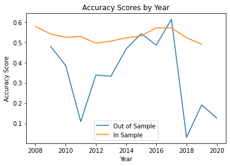

The incrimental multinomial regression has an accuracy of 50-60% during stationary periods and the performance dips to at or below chance levels (25%) during periods of change.

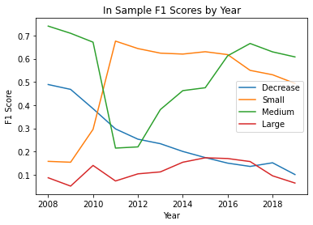

The in-sample accuracy was consistent over time. However, we can see some performance issues coming from the decreases in PCVPU and and large increases. However, it appears that the small dip in performance during the financial crisis resulted mostly from mistakes categorizing changes of a medium magnitude.

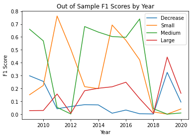

The out-of-sample F1-scores track with the dips in performance observed in the in-sample case, but we can also see a massive drop in performance with the 2018-2019 reporting standard transition.


### Random Forest Model

**Incrimental Random Forest**

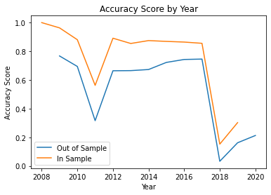

The random forest does significantly better than the regression, performing at 60-80% accuracy during nominal years. However, the accuracy scores still dip significantly during the financial crisis and during the reporting standards transition. The in-sample performance tracks with the out-of-sample performance much more closely, demonstrating significantly less over-fitting than with the regression.

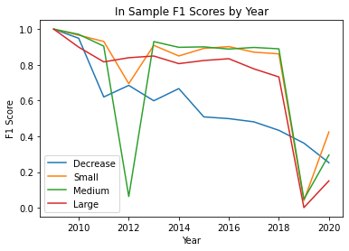

The in-sample performance is mostly high, and the medium-magnitute category is the most affected by the financial crisis. Moreover, the negative-magnitude (decreasing) category loses its performance steadily as the model moves past the financial crisis, where most of the decreases occurred.

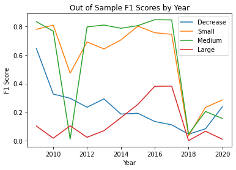

The model has a disproportionately hard time predicting large-magnitude changes in PCVPU.


### Boosted Tree Model

**Incrimental Boosted Tree**

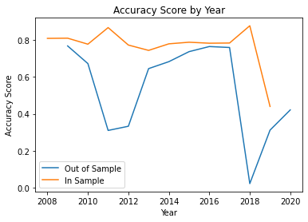

The boosted tree was able to retain its higher in-sample performance levels during the 2008-2011 financial crisis, which is an improvement over the random forest model. However, its out-of-sample performance still suffered about as much as the random forest. The in-sample performance does not track with out-of-sample performance nearly as well. This suggests that there may be over-fitting.

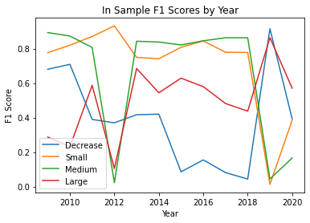

The boosted model is better over-all at predicting large magnitude changes in-sample when compared with the random forest.

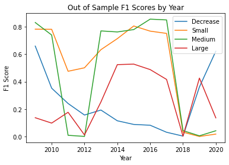

This remains true for the out-of-sample case, although the performance is lower overall.

The boosted tree model failed to exceed the performance of the random forest. However, it is important to note that, due to computational and time constraints, fine-tuning was not conducted. As a result, it is possible that the boosted tree would exceed the random forest's performance if a grid search were conducted for both methods.

### Forgetful Models
None of the forgetful models performed better than the incremental models, so they were excluded from the report. The code for each model and a partial set of figures can be found in the supplementary files.

## 5 Future Directions

There was very limited time to test or tune models. Computational budget constraints made grid search and automated feature selection impractical. Moreover, no neural networks were tested. In the future, the obvious next step would be to obtain a more powerful computing platform in order to run grid search and feature selection algorithms.

Additionally, there are many neural network architectures that might be explored. Moreover, geo-spatial techniques might be used to train a convolutional neural network on data matched to the PLUTO shapefile map.

Lastly, the data set that was constructed in this project could be a valuable resource to others. It would make sense to review the code for mistakes and post the final product on GitHub and Kaggle.


<div style="page-break-after: always;"></div>

## Appendix A: Continuous Forecasting Results

### Continuous Incremental Forecasting Results

The continuous forecasting results were very poor. None of the models exceeded an $R^2$ score of 25%.

### Benchmark Model

Incremental Linear Model The $R^2$ score hovers around 0% for most years and then takes a major dip at 2018, the first year that incorporates 2019 data (as its forecasting target)

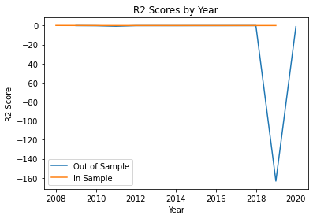

Mean squared errors were computed, but given the low performance of the models, they were excluded. They can be found in the supplementary files.


### Random Forest Model

**Incremental Random Forest**

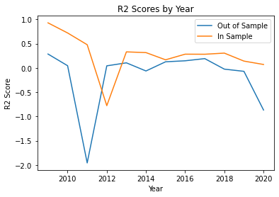

The incremental random forest model did significantly better than the regression models, but still fails to provide predictions that account for more than 25% of the data's variation. Moreover, the $R^2$ scores dip well below zero on several years.

### Boosted Tree Model

**Incremental Boosted Tree**

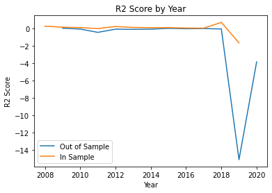

The boosted tree performs similarly to the random forest, though more consistently before 2018 (about $R^2 \approx 20\%$ for most years). However, it takes an extreme dip when the reporting standards change. This susceptibility to change likely resulted from the boosted model's greater propensity for over-fitting.


